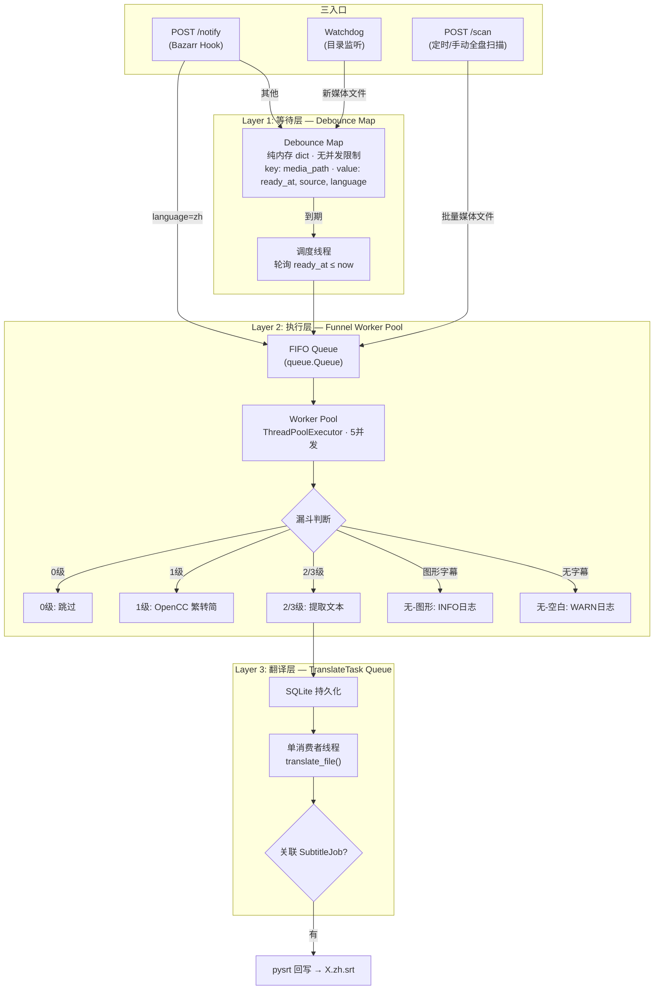
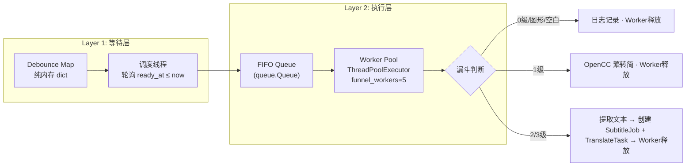
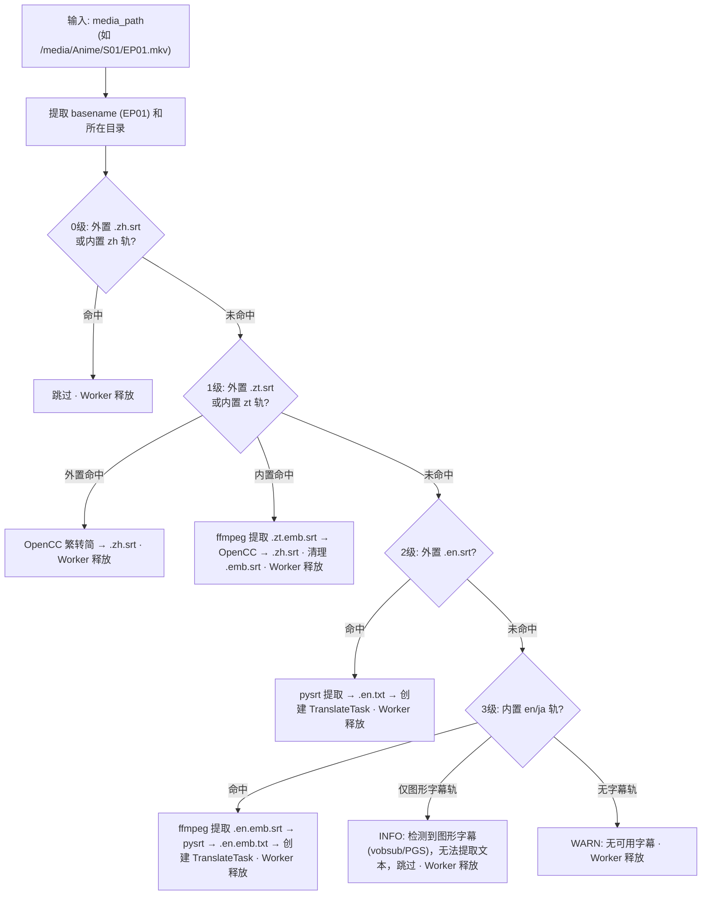
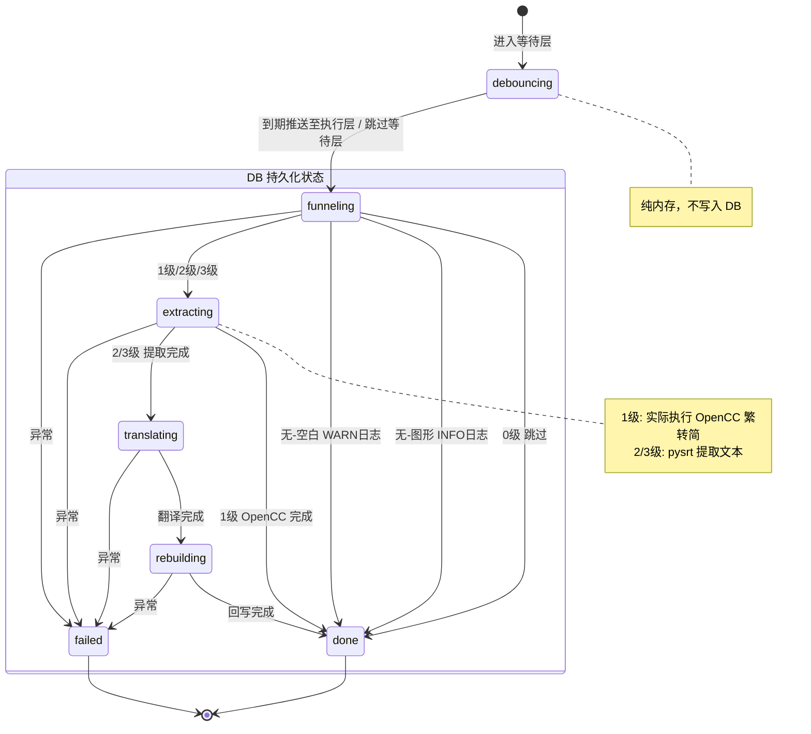
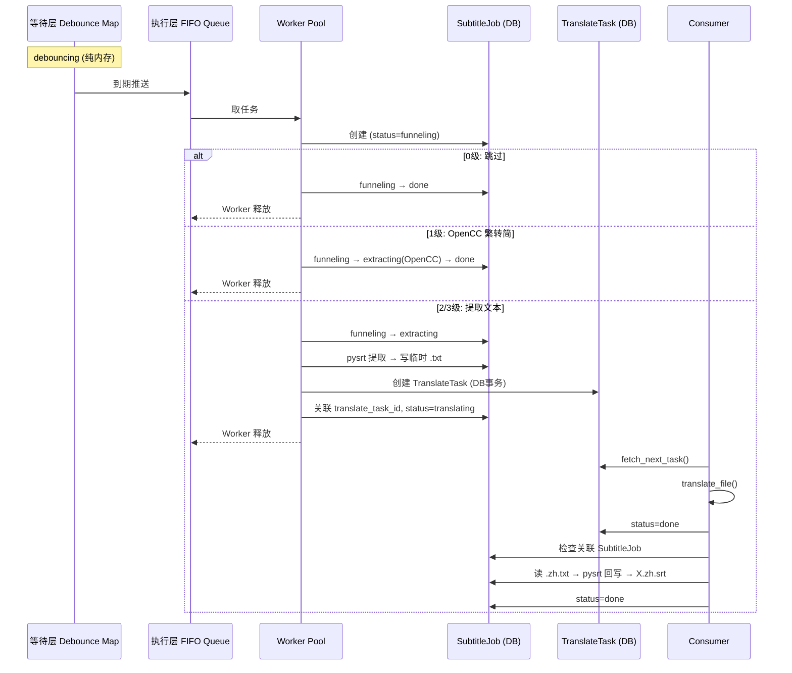

# SubtitleTranslator Phase 2 — 需求规格文档

> 版本: 1.1
> 日期: 2026-04-28
> 状态: 需求已锁定，3 项待定
> 前置: Phase 1 (纯文本翻译管道) 已完成

---

## 一、定位与核心原则

### 1.1 目标

从「纯文本翻译管道」升级为「字幕感知翻译管道」——系统自动判断媒体文件的字幕状态，按优先级漏斗选择最优路径，最终产出简中 SRT 字幕文件。

### 1.2 与 Phase 1 的关系

```
Phase 1:  .txt → 空行映射 → 翻译管道 → .zh.txt
Phase 2:  媒体文件 → 漏斗判断 → 提取纯文本写临时.txt → translate_file() → 读译文回写 .zh.srt
```

**核心原则**：

- `translate_file()` **零改动**，Phase 2 通过临时 .txt 文件桥接
- Phase 1 翻译管道所有环境变量和逻辑**保持不变**
- 队列只存路径字符串，不存文本内容，内存占用与队列长度无关
- pysrt 对象只在提取和回写时短暂驻留内存，翻译期间不占内存

---

## 二、完整架构

### 2.1 三层管道

三个入口最终汇入三层管道，逐层收窄并发：

| 层 | 名称 | 并发模型 | 职责 |
|:--:|------|----------|------|
| L1 | 等待层 | 无限并发，纯内存 | Debounce 去重 + 延迟等待 |
| L2 | 执行层 | 有限并发 (5) | 漏斗判断 + 即时分流 |
| L3 | 翻译层 | 顺序执行 | translate_file() + SRT 回写 |

### 2.2 架构总览



### 2.3 入口路由规则

| 入口 | 条件 | 路由目标 |
|------|------|----------|
| POST /notify | language=zh | 跳过等待层，直接入执行层 FIFO Queue |
| POST /notify | 其他/无 language | 进入等待层 Debounce Map |
| Watchdog | 新媒体文件 | 进入等待层 Debounce Map |
| POST /scan | 批量媒体文件 | 跳过等待层，直接入执行层 FIFO Queue |

---

## 三、三入口

### 3.1 POST /notify (Bazarr Hook)

Bazarr 下载完字幕后通过 Custom Post-Processing 脚本触发。

**Bazarr 可用字段**：

| 字段 | 说明 | 用途 |
|------|------|------|
| `episode` | 剧集文件完整路径 | Debounce 去重键 (media_path) |
| `subtitles` | 字幕文件完整路径 | 辅助信息，记入日志 |
| `subtitles_language_code2` | 2位 ISO-639 语言码 (可能含 `:hi`/`:forced` 后缀，也可能无后缀) | 语言判断，zh 立即触发 |

**Bazarr Post-Processing 脚本**：

```bash
#!/bin/bash
curl -X POST http://subtitle-translator:9800/notify \
  -H "Content-Type: application/json" \
  -d "{
    \"media_path\": \"${episode}\",
    \"language\": \"${subtitles_language_code2}\",
    \"subtitle_path\": \"${subtitles}\"
  }"
```

**请求体**：

| 字段 | 必填 | 说明 |
|------|------|------|
| `media_path` | 是 | 视频文件路径 |
| `language` | 否 | 字幕语言码，可能含 `:hi`/`:forced` 后缀，也可能无后缀 |
| `subtitle_path` | 否 | 字幕文件路径，辅助信息 |

**处理逻辑**：

1. `media_path` 必须是媒体文件路径，不允许目录
2. `language` 经 `normalize_language()` 映射后为 `zh` → 跳过等待层，直接入执行层 FIFO Queue
3. 其他/无 `language` → 进入等待层 Debounce Map

**zh 立即触发**：简中字幕已到达意味着最优结果已出现，漏斗会 0 级命中直接跳过，无需等待。

### 3.2 Watchdog (目录监听)

- **监听目标**：`/media` 下新增的 `.mkv`、`.mp4` 等媒体文件
- **存在理由**：Bazarr 没搜到字幕时不触发 Hook，Watchdog 兜底
- **处理**：检测到新媒体文件 → 立即进入等待层 Debounce Map
- **事件过滤**：只响应 FileCreatedEvent，忽略 FileModifiedEvent、隐藏文件、临时文件
- **技术选型**：Python `watchdog` 库

### 3.3 POST /scan (定时/手动全盘扫描)

- **扫描对象**：媒体文件 (非 .txt)
- **处理**：递归遍历目录 → 对每个媒体文件直接入执行层 FIFO Queue (跳过等待层)
- **需要翻译的** → 由 Worker Pool 执行漏斗后分流至翻译层

---

## 四、三层管道

### 4.1 Layer 1: 等待层 (Debounce Map)

同一个媒体文件，Bazarr 可能渐续下载多个字幕。等待层等待所有字幕下载完成后再推送至执行层。

**Debounce 行为**：同一 `media_path` 新事件到达时，重置 `ready_at = now + DEBOUNCE_SECONDS`。

**独立并发**：不同媒体文件各自独立倒计时，互不阻塞。A 等 4 分钟、B 等 1 分钟，B 先进入执行层。

**Debounce Map 结构**：

- key: media_path
- value: {ready_at, source, language}
- language=zh → 立即将 ready_at 设为 now

**调度线程**：轮询 Map，找 ready_at ≤ now → 移入执行层 FIFO Queue。

**不持久化**：容器重启后丢失，三重兜底确保不永久丢失：
1. Watchdog 重启后重新检测
2. 定时 scan 兜底
3. Bazarr Hook 下次触发

### 4.2 Layer 2: 执行层 (Funnel Worker Pool)

所有入口最终汇入此层的 FIFO Queue，由 Worker Pool 消费并执行漏斗判断。



**FIFO Queue**：`queue.Queue`，到期任务和直接进入的任务统一排队。入队前检查 Debounce Map 中是否已有同 key，避免同一媒体文件在等待层和执行层同时存在（见决策 #32）。

**Worker Pool**：`ThreadPoolExecutor(max_workers=config.funnel_workers)`（默认 5），从 FIFO Queue 取任务执行漏斗。

**/scan 也走 FIFO Queue**：全盘扫描的批量文件也进入 FIFO Queue，由 Worker Pool 限流消费，避免同时跑大量 ffprobe 打爆系统。

**漏斗分流**：
- 0级/图形字幕/无字幕 → 日志记录 (区分 INFO/WARN)，Worker 立即释放
- 1级 → Worker 内执行 OpenCC 繁转简，完成后释放
- 2/3级 → pysrt 提取文本 → 创建 SubtitleJob + TranslateTask → Worker 释放

**并发数为什么是 5**：
- ffprobe 是子进程，不占 Python GIL，5 个并行 ≈ 5 个独立进程
- 文件系统 I/O 在 NAS 上并行读无问题
- 再多则磁盘 I/O 成为瓶颈

### 4.3 Layer 3: 翻译层 (TranslateTask Queue)

与 Phase 1 完全一致，单消费者线程顺序执行 translate_file()。详见第七节。

---

## 五、判断漏斗

### 5.1 优先级表

| 级别 | 命中条件 | 动作 | 耗时 |
|:---:|---|---|:---:|
| 0级 | 外置 `X.zh.srt` 存在 或 内置含 `zh` 轨 | 跳过 | 0s |
| 1级 | 外置 `X.zt.srt` 存在 或 内置含 `zt` 轨 | OpenCC 繁转简 → `X.zh.srt` (漏斗内完成) | <1s |
| 2级 | 外置 `X.en.srt` 存在 | pysrt 提取 → 写临时 .txt → 创建 TranslateTask | — |
| 3级 | 内置含 en/ja 轨 | ffmpeg 提取 → 写临时 .txt → 创建 TranslateTask | <1s |
| 无-图形 | 内置仅含图形字幕轨 (vobsub/PGS) | INFO 日志说明原因 · 跳过 | 0s |
| 无-空白 | 以上都不满足 | WARN 日志 · 跳过 | 0s |

**图形字幕说明**：vobsub (`dvd_subtitle`)、PGS (`pgssub`/`hdmv_pgs_subtitle`) 等图形字幕无法提取为文本，行为等同于"无可用字幕"，但日志中明确标注原因，便于后续排查。

### 5.2 执行流程



**优化**：每级优先检查外置字幕 (文件系统快)，外置已命中则跳过 ffprobe (进程调用慢)。

### 5.3 语言标签映射

ffprobe 的 `language` tag、外置字幕文件名后缀、Bazarr Hook 的语言码都存在变体，统一映射：

```python
LANG_MAP = {
    "zh": "zh", "zho": "zh", "chi": "zh", "chinese": "zh", "zh-cn": "zh", "zh-hans": "zh",
    "zt": "zt", "zht": "zt", "zh-tw": "zt", "zh-hant": "zt",
    "en": "en", "eng": "en", "english": "en",
    "ja": "ja", "jpn": "ja", "japanese": "ja",
}
```

**语言码后缀剥离**：

```python
def normalize_language(lang_code: str) -> str:
    """剥离 hi/forced 后缀，返回基础语言码"""
    base = lang_code.split(":")[0].split(".")[0].lower()
    return LANG_MAP.get(base, base)
# "zh" → "zh", "zh:hi" → "zh", "en:forced" → "en", "chi" → "zh"
```

通过环境变量 `LANG_MAP_OVERRIDE` (JSON 格式) 可追加映射，如 `{"sc":"zh","tc":"zt"}`。

### 5.4 外置字幕与媒体文件匹配

```
规则: 剥离语言后缀 + basename 精确匹配
  EP01.zh.srt   → "EP01" → 匹配 EP01.mkv ✓
  EP01.chi.srt  → "EP01" → 匹配 EP01.mkv ✓
  EP01 - 1080p.en.srt → "EP01 - 1080p" → 匹配 EP01 - 1080p.mkv ✓

原则: Bazarr 保证命名前缀一致，不一致的跳过
```

### 5.5 多字幕轨

- 优先级：zh > zt > en > ja
- 同时有 zt 和 en → 选 zt (繁转简比翻译快)
- 多条同语言轨 → 取第一条

---

## 六、SRT 翻译管道

### 6.1 数据流

**2/3级 (需翻译)**：

```
Step 1: 漏斗提取 (pysrt 短暂驻留内存)
  2级: pysrt 加载 X.en.srt → 提取纯文本 → 写入 X.en.txt → 释放 pysrt
  3级: ffmpeg 提取内置轨 → X.en.emb.srt → pysrt 加载 → 提取纯文本 → 写入 X.en.emb.txt → 释放 pysrt

Step 2: 翻译 (translate_file 零改动)
  2级: translate_file(task_id, "X.en.txt") → 生成 X.zh.txt
  3级: translate_file(task_id, "X.en.emb.txt") → 生成 X.en.emb.zh.txt

Step 3: 回写 (pysrt 短暂驻留内存)
  2级: pysrt 重新加载 X.en.srt → 读 X.zh.txt → 对位替换 text → 保存 X.zh.srt
  3级: pysrt 重新加载 X.en.emb.srt → 读 X.en.emb.zh.txt → 对位替换 text → 保存 X.zh.srt

Step 4: 清理
  2级: 删除 X.en.txt, X.zh.txt
  3级: 删除 X.en.emb.srt, X.en.emb.txt, X.en.emb.zh.txt
```

**1级 (繁转简，不走翻译层)**：

```
1级外置: pysrt 加载 X.zt.srt → OpenCC 繁转简 → 保存 X.zh.srt
1级内置: ffmpeg 提取内置 zt 轨 → X.zt.emb.srt → pysrt 加载 → OpenCC 繁转简 → 保存 X.zh.srt → 删除 X.zt.emb.srt
```

### 6.2 临时文件链

**1级外置 (外置繁体 SRT)**：

```
原始:   EP01.zt.srt           (不删除)
产物:   EP01.zh.srt           (OpenCC 输出)
```

**1级内置 (内置 zt 轨)**：

```
提取:   EP01.zt.emb.srt       (ffmpeg 提取，清理)
产物:   EP01.zh.srt           (OpenCC 输出)
```

**2级 (外置英文/日文 SRT)**：

```
原始:   EP01.en.srt           (不删除，回写模板)
输入:   EP01.en.txt           (pysrt 提取，清理)
续传:   EP01.en.txt.tmp       (translate_file 内部管理)
译文:   EP01.zh.txt           (translate_file 输出，清理)
最终:   EP01.zh.srt           (pysrt 回写产物)
```

**3级 (内置 en/ja 轨)**：

```
提取:   EP01.en.emb.srt       (ffmpeg 提取，清理，回写模板)
输入:   EP01.en.emb.txt       (pysrt 提取，清理)
续传:   EP01.en.emb.txt.tmp   (translate_file 内部管理)
译文:   EP01.en.emb.zh.txt    (translate_file 输出，清理)
最终:   EP01.zh.srt           (pysrt 回写产物)
```

**命名规则**：

| 段 | 含义 | 示例 |
|---|---|---|
| `X` | basename | EP01 |
| `.en` / `.zt` | 源语言码 | en=英文, zt=繁体 |
| `.emb` | 内置提取标记 (embedded) | 仅 1级内置和 3级使用 |
| `.txt` | 提取的纯文本 | 翻译输入 |
| `.zh.txt` | 翻译输出 | 2级: X.zh.txt, 3级: X.en.emb.zh.txt |
| `.txt.tmp` | translate_file 续传断点 | 内部管理，翻译完成自动清理 |
| `.srt` | SRT 字幕文件 | 提取中间文件或最终产物 |

### 6.3 关键实现细节

**2级提取 (pysrt)**：

```python
subs = pysrt.open("EP01.en.srt")
texts = [sub.text.replace("\n", " ") for sub in subs]
with open("EP01.en.txt", "w", encoding="utf-8") as f:
    for text in texts:
        f.write(text + "\n")
```

**3级提取 (ffmpeg + pysrt)**：

```python
# stream_index 由漏斗判断返回（ffprobe 检测到的字幕轨索引）
subprocess.run(
    ["ffmpeg", "-i", "EP01.mkv", "-map", f"0:s:{stream_index}", "EP01.en.emb.srt"],
    check=True
)
subs = pysrt.open("EP01.en.emb.srt")
texts = [sub.text.replace("\n", " ") for sub in subs]
with open("EP01.en.emb.txt", "w", encoding="utf-8") as f:
    for text in texts:
        f.write(text + "\n")
```

多行字幕合并为单行翻译，回写保持单行。

**2级回写 (pysrt)**：

```python
subs = pysrt.open("EP01.en.srt")
with open("EP01.zh.txt", "r", encoding="utf-8") as f:
    translated_lines = [line.strip() for line in f.readlines() if line.strip()]
for i, sub in enumerate(subs):
    if i < len(translated_lines):
        sub.text = translated_lines[i]
subs.save("EP01.zh.srt", encoding="utf-8")
```

**3级回写 (pysrt)**：

```python
subs = pysrt.open("EP01.en.emb.srt")
with open("EP01.en.emb.zh.txt", "r", encoding="utf-8") as f:
    translated_lines = [line.strip() for line in f.readlines() if line.strip()]
for i, sub in enumerate(subs):
    if i < len(translated_lines):
        sub.text = translated_lines[i]
subs.save("EP01.zh.srt", encoding="utf-8")
```

**1级外置繁转简 (OpenCC)**：

```python
converter = opencc.OpenCC("t2s.json")
subs = pysrt.open("EP01.zt.srt")
for sub in subs:
    sub.text = converter.convert(sub.text)
subs.save("EP01.zh.srt", encoding="utf-8")
```

**1级内置繁转简 (ffmpeg + OpenCC)**：

```python
# stream_index 由漏斗判断返回（ffprobe 检测到的字幕轨索引）
subprocess.run(
    ["ffmpeg", "-i", "EP01.mkv", "-map", f"0:s:{stream_index}", "EP01.zt.emb.srt"],
    check=True
)
converter = opencc.OpenCC("t2s.json")
subs = pysrt.open("EP01.zt.emb.srt")
for sub in subs:
    sub.text = converter.convert(sub.text)
subs.save("EP01.zh.srt", encoding="utf-8")
os.remove("EP01.zt.emb.srt")
```

---

## 七、双模型架构：SubtitleJob + TranslateTask

### 7.1 分离原则

| | SubtitleJob (字幕作业) | TranslateTask (翻译任务) |
|---|---|---|
| 关注点 | "这个媒体文件需要什么处理？" | "把这个 .txt 翻译成 .zh.txt" |
| 知道 | 媒体文件、漏斗、SRT、清理 | 文件路径、进度、断点续传 |
| 不知道 | LLM、分批、翻译细节 | 媒体文件、字幕、漏斗 |

### 7.2 TranslateTask (翻译任务)

与 Phase 1 完全一致，**零新增字段**：

```sql
CREATE TABLE translate_task (
    id TEXT PRIMARY KEY,
    file_path TEXT NOT NULL,
    status TEXT NOT NULL,           -- queued/processing/done/failed
    progress TEXT,
    current_batch INTEGER DEFAULT 0,
    total_batches INTEGER DEFAULT 0,
    created_at TEXT NOT NULL,
    updated_at TEXT NOT NULL,
    error TEXT
);
```

**表名变更**：Phase 1 的 `task` 表重命名为 `translate_task`（项目尚在开发阶段，直接重命名，无需迁移）。

### 7.3 SubtitleJob (字幕作业)

```sql
CREATE TABLE subtitle_job (
    id TEXT PRIMARY KEY,
    media_path TEXT NOT NULL,
    status TEXT NOT NULL,           -- funneling/extracting/translating/rebuilding/done/failed
    funnel_level INTEGER,           -- 0/1/2/3/null
    original_srt_path TEXT,         -- 用于 pysrt 回写
    output_srt_path TEXT,           -- 输出 .zh.srt 路径
    cleanup_files TEXT,             -- JSON 数组
    translate_task_id TEXT,         -- 关联的翻译任务 ID
    created_at TEXT NOT NULL,
    updated_at TEXT NOT NULL,
    error TEXT
);
```

**SubtitleJob 状态机**：



`debouncing` 状态仅在等待层内存中，不写入 DB。从 `funneling` 开始写入 DB。

### 7.4 交互流程



### 7.5 竞态条件

创建 TranslateTask 和关联 SubtitleJob 在同一个 DB 事务中提交，Consumer 在 commit 之前看不到 TranslateTask，commit 后关联已生效。

```python
def create_translate_task_for_job(job_id: str, file_path: str) -> str:
    task_id = str(uuid.uuid4())
    with sqlite3.connect(DB_PATH) as conn:
        conn.execute("INSERT INTO translate_task ...", (task_id, file_path, ...))
        conn.execute("UPDATE subtitle_job SET translate_task_id = ?, status = 'translating' WHERE id = ?", (task_id, job_id))
        conn.commit()
    return task_id
```

### 7.6 Consumer 处理逻辑

```python
def consumer_loop():
    while True:
        task = fetch_next_translate_task()
        translate_file(task.id, task.file_path)

        task = get_task(task.id)
        job = get_subtitle_job_by_translate_task(task.id)
        if not job:
            continue
        if task.status == "failed":
            update_job_status(job.id, "failed", error=task.error)
        elif task.status == "done":
            try:
                rebuild_srt(job)
                cleanup_intermediate_files(job)
                update_job_status(job.id, "done")
            except Exception as e:
                logger.error(f"rebuild_srt failed for job {job.id}: {e}")
                update_job_status(job.id, "failed", error=str(e))
        else:
            logger.error(f"Unexpected task status after translate_file: {task.status}")
```

所有 TranslateTask 均由漏斗创建并关联 SubtitleJob，翻译失败时同步更新 SubtitleJob 为 `failed`。回写失败时 TranslateTask 保持 `done`（翻译本身已成功），仅标记 SubtitleJob 为 `failed`。

---

## 八、配置方案：config.json + 环境变量覆盖

### 8.1 设计原则

- **config.json** 承载所有配置项，提供默认值，修改后重启生效
- **环境变量** 作为覆盖层，优先级高于 config.json
- **必填项** 仅 `LLM_API_URL` 和 `LLM_API_KEY`，无默认值，缺失时程序退出
- 默认值只在 `config_loader.py` 的 `DEFAULTS` 字典中定义一份，config.json 是其物化输出

**优先级**：环境变量 > config.json > 代码默认值

### 8.2 启动加载流程

```
每次启动:
  1. 检测 /app/config/config.json 是否存在
     不存在 → 用 DEFAULTS 生成 config.json
     存在   → 读取
  2. 遍历环境变量映射表，有设置则覆盖对应字段
  3. 将覆盖后的最终配置写回 config.json (保证文件始终反映实际运行配置)
  4. 校验必填项 (LLM_API_URL, LLM_API_KEY)
  5. 根据 model_type 检测 /app/prompts/ 目录
     不存在 → 生成默认 system_prompt.txt + glossary.json
     存在   → 读取
  6. 返回最终配置对象
```

**写回原则**：环境变量覆盖后必须写回 config.json，确保文件内容始终与实际运行配置一致。其他模块严格从 config 对象取值，不设默认值，取不到直接报错。

**限速配置语义**：`rpm_limit`/`tpm_limit` 存储的是 **API 提供商的限额值**（如 1000 RPM / 50000 TPM），代码内部使用时自动计算留余量阈值（如 `rpm_limit - 100 = 900` / `tpm_limit - 5000 = 45000` 作为实际拦截点），不在配置中暴露内部阈值（见决策 #9）。

### 8.3 config.json 结构

```json
{
  "app_port": 9800,
  "llm": {
    "api_url": "",
    "api_key": "",
    "model": "deepseek-chat",
    "model_type": "chat",
    "timeout": 120,
    "batch_size": 20,
    "context_size": 5,
    "rpm_limit": 1000,
    "tpm_limit": 50000,
    "max_retries": 3
  },
  "pipeline": {
    "debounce_seconds": 60,
    "debounce_poll_interval": null,
    "funnel_workers": 5,
    "scan_interval": 0,
    "scan_dir": "/media"
  },
  "media": {
    "extensions": [".mkv", ".mp4", ".avi", ".wmv", ".flv", ".ts", ".m2ts"],
    "lang_map_override": {}
  },
  "watchdog": {
    "enabled": true,
    "path": "/media"
  }
}
```

### 8.4 环境变量覆盖映射

**必填**（无默认值，缺失时程序退出）：

| 环境变量 | 覆盖路径 |
|----------|----------|
| `LLM_API_URL` | `llm.api_url` |
| `LLM_API_KEY` | `llm.api_key` |

**可选**（config.json 提供默认值，环境变量可覆盖）：

| 环境变量 | 覆盖路径 | config.json 默认值 | 类型转换 |
|----------|----------|-------------------|----------|
| `APP_PORT` | `app_port` | `9800` | int |
| `LLM_MODEL` | `llm.model` | `"deepseek-chat"` | str |
| `LLM_MODEL_TYPE` | `llm.model_type` | `"chat"` | str |
| `LLM_TIMEOUT` | `llm.timeout` | `120` | int |
| `BATCH_SIZE` | `llm.batch_size` | `20` | int |
| `CONTEXT_SIZE` | `llm.context_size` | `5` | int |
| `RPM_LIMIT` | `llm.rpm_limit` | `1000` | int |
| `TPM_LIMIT` | `llm.tpm_limit` | `50000` | int |
| `MAX_RETRIES` | `llm.max_retries` | `3` | int |
| `DEBOUNCE_SECONDS` | `pipeline.debounce_seconds` | `60` | int |
| `DEBOUNCE_POLL_INTERVAL` | `pipeline.debounce_poll_interval` | `null` (待定) | int |
| `FUNNEL_WORKERS` | `pipeline.funnel_workers` | `5` | int |
| `SCAN_INTERVAL` | `pipeline.scan_interval` | `0` | int |
| `SCAN_DIR` | `pipeline.scan_dir` | `"/media"` | str |
| `MEDIA_EXTENSIONS` | `media.extensions` | `[.mkv,.mp4,...]` | 逗号分隔→list |
| `LANG_MAP_OVERRIDE` | `media.lang_map_override` | `{}` | JSON字符串→dict |
| `WATCHDOG_ENABLED` | `watchdog.enabled` | `true` | "true"/"false"→bool |
| `WATCHDOG_PATH` | `watchdog.path` | `"/media"` | str |

### 8.5 Docker 部署

```yaml
volumes:
  - ./config:/app/config    # 持久化配置目录
  - ./data:/app/data
  - ./logs:/app/logs
  - ./prompts:/app/prompts
  - ./media:/media

environment:
  - LLM_API_URL=https://api.example.com/v1/chat/completions
  - LLM_API_KEY=sk-xxxxxxxxxxxxxxxx
  # 其他配置项已在 config.json 中设置，无需重复声明
  # 如需覆盖 config.json 中的值，在此添加对应环境变量即可
```

**与 Phase 1 的关系**：Phase 1 采用纯环境变量方式（`SubtitleTranslator.env`），Phase 2 被 `config.json` 替代。环境变量仍可通过 Docker Compose `environment` 段设置，用于覆盖 config.json 值或提供必填项（`LLM_API_URL`、`LLM_API_KEY`）。首次启动设置的环境变量会写回 config.json 成为永久配置，后续移除环境变量不会还原。

---

## 九、新增依赖

```
# requirements.txt 新增
pysrt==1.1.2          # SRT 字幕解析
OpenCC==1.1.7         # 繁简转换
watchdog==4.0.0       # 目录监听
```

Dockerfile 新增：

```dockerfile
RUN apt-get update && apt-get install -y --no-install-recommends ffmpeg && rm -rf /var/lib/apt/lists/*
```

---

## 十、API 设计

### 10.1 POST /notify (新增)

```bash
curl -X POST http://subtitle-translator:9800/notify \
  -H "Content-Type: application/json" \
  -d '{"media_path": "/media/Anime/S01/EP01.mkv", "language": "en", "subtitle_path": "/media/Anime/S01/EP01.en.srt"}'
```

| 字段 | 必填 | 说明 |
|------|------|------|
| `media_path` | 是 | 视频文件路径（必须是文件，不允许目录） |
| `language` | 否 | 字幕语言码，可能含 `:hi`/`:forced` 后缀 |
| `subtitle_path` | 否 | 字幕文件路径，辅助信息 |

响应：

```json
{
  "status": "accepted",
  "route": "debounce",
  "message": "已进入等待层，将在 60 秒后处理"
}
```

`language=zh` 时 `route` 为 `"immediate"`，跳过等待层直接进入执行层。

### 10.2 POST /scan (变更)

扫描对象从 `.txt` 变为媒体文件（Breaking Change，见决策 #21），对每个媒体文件入执行层 FIFO Queue。

```bash
curl -X POST http://subtitle-translator:9800/scan \
  -H "Content-Type: application/json" \
  -d '{"dir_path": "/media/Anime"}'
```

| 字段 | 必填 | 说明 |
|------|------|------|
| `dir_path` | 是 | 扫描根目录 |

响应（成功）：

```json
{
  "count": 15,
  "message": "已扫描到 15 个待处理媒体文件，已加入执行层队列"
}
```

响应（扫描进行中）：

```json
{
  "error": "Scan already in progress",
  "message": "上次扫描尚未完成，请稍后重试"
}
```

HTTP 状态码 `409 Conflict`。

### 10.3 内部服务说明: translate_file()

> **注意**：`POST /translate` 已移除，以下为内部调用说明。

`POST /translate` 对外接口**移除**。翻译功能改为内部服务，仅由 Consumer 线程调用 `translate_file()`。所有 TranslateTask 均由漏斗创建并关联 SubtitleJob。(见决策 #22)

---

## 十一、目录结构

```
app/
├── main.py                     # 入口: FastAPI 启动 + 三层管道初始化
├── api.py                      # HTTP 路由: /notify, /scan
├── db.py                       # 数据库层: translate_task + subtitle_job (原 queue_db.py)
├── config_loader.py            # 配置加载: config.json + 环境变量覆盖
├── requirements.txt            # 依赖
│
├── config/                     # 配置目录 (Docker volume 挂载)
│   └── config.json             #   运行时配置 (首次启动自动生成)
│
├── prompts/                    # Prompt 目录 (Docker volume 挂载，首次启动根据 model_type 自动生成)
│   ├── system_prompt.txt       #   系统提示词
│   └── glossary.json           #   术语表
│
├── pipeline/                   # 三层管道核心
│   ├── __init__.py
│   ├── debounce_queue.py       #   等待层 (Debounce Map) + 执行层 (FIFO + Worker Pool)
│   ├── funnel.py               #   判断漏斗
│   └── consumer.py             #   翻译层消费 + SRT 回写
│
├── subtitle/                   # 字幕处理
│   ├── __init__.py
│   ├── srt_handler.py          #   SRT 解析/回写 (pysrt)
│   ├── opencc_handler.py       #   繁简转换 (OpenCC)
│   └── ffmpeg_handler.py       #   ffmpeg/ffprobe 封装
│
├── scanner/                    # 输入源扫描
│   ├── __init__.py
│   ├── media_scanner.py        #   媒体文件扫描 (替代 Phase 1 scanner.py)
│   ├── watchdog_monitor.py     #   目录监听 (watchdog)
│   └── scheduler.py            #   定时扫描 (APScheduler)
│
└── translate/                  # 翻译引擎 (Phase 1 核心)
    ├── __init__.py
    ├── translator.py           #   翻译主逻辑
    ├── prompt_loader.py        #   Prompt 加载
    ├── rate_limiter.py         #   限速
    └── eta_tracker.py          #   ETA 追踪
```

**变更说明**：

| 变更 | 说明 |
|------|------|
| `queue_db.py` → `db.py` | Phase 2 管理两张表，不再只是"队列"数据库 |
| `scanner.py` 移除 | Phase 1 的 .txt 扫描器，被 `media_scanner.py` 替代 |
| 新增 `config_loader.py` | 统一配置加载：config.json + 环境变量覆盖 |
| 新增 `config/` | 配置目录，Docker volume 挂载，首次启动自动生成 config.json |
| 新增 `prompts/` | Prompt 目录，Docker volume 挂载，首次启动根据 model_type 自动生成 |
| 新增 `pipeline/` | 三层管道核心：等待层、执行层、翻译层消费 |
| 新增 `subtitle/` | 字幕处理：SRT、OpenCC、ffmpeg |
| 新增 `scanner/` | 输入源：媒体扫描、Watchdog、定时器 |
| 新增 `translate/` | Phase 1 翻译引擎，独立成包 |

---

## 十二、决策汇总

### A. 架构总览

| # | 决策项 | 结论 |
|---|--------|------|
| 1 | 三层管道架构 | **等待层(Debounce Map) → 执行层(Funnel Worker Pool) → 翻译层(TranslateTask Queue)**，逐层收窄并发 |
| 2 | 任务粒度 | **以媒体文件为单位**，不是目录 |
| 3 | 双模型架构 | **SubtitleJob + TranslateTask**，关注点分离 |

### B. 配置

| # | 决策项 | 结论 |
|---|--------|------|
| 4 | 配置方案 | **config.json + 环境变量覆盖**：config.json 承载所有配置项，环境变量优先级更高，必填仅 LLM_API_URL 和 LLM_API_KEY。Phase 1 配置项全部迁移至 config.json |
| 5 | config.json 生成 | **启动时自动生成**：不存在则用 DEFAULTS 生成，存在则读取，环境变量覆盖后写回 config.json |
| 6 | 默认值单一来源 | **只在 config_loader.py 的 DEFAULTS 中定义**，其他模块不设默认值，从 config 取值取不到直接报错 |
| 7 | Prompts 处理 | **独立目录自动生成**：路径硬编码 `/app/prompts/`，根据 model_type 生成 system_prompt.txt + glossary.json，用户通过 volume 映射覆盖内容 |
| 8 | 媒体扩展名 | **默认 7 种**，config.json `media.extensions` 配置，环境变量 `MEDIA_EXTENSIONS` 可覆盖 |
| 9 | 限速配置语义 | config.json 中 `rpm_limit`/`tpm_limit` 存储 **API 提供商的限额值**，内部阈值（留余量）在代码中硬编码计算（如 `rpm_limit - 100` / `tpm_limit - 5000`） |
| 10 | config.json 路径 | 硬编码 **`/app/config/config.json`** |

### C. 数据模型与持久化

| # | 决策项 | 结论 |
|---|--------|------|
| 11 | TranslateTask 表 | **与 Phase 1 完全一致，零新增字段** |
| 12 | SubtitleJob 持久化 | **SQLite**，从 funneling 状态开始写入 |
| 13 | SubtitleJob 状态机 | debouncing(纯内存)→funneling→extracting→translating→rebuilding→done/failed |
| 14 | 竞态条件 | **DB 事务原子操作**: 创建 TranslateTask + 关联 SubtitleJob 同一事务 |

### D. 入口与路由

| # | 决策项 | 结论 |
|---|--------|------|
| 15 | Bazarr Hook 入口 | **保留**，与 Watchdog 共享等待层 Debounce Map，事件去重 |
| 16 | Watchdog 监听对象 | **只监听媒体文件**，不监听字幕文件，检测到新媒体文件立即进入等待层 |
| 17 | /notify 入参 | **media_path + 可选 language + 可选 subtitle_path** |
| 18 | /notify language=zh | **跳过等待层**，直接入执行层 FIFO Queue |
| 19 | API 字段命名 | **media_path** |
| 20 | /scan 路由 | **也走执行层 FIFO Queue**，由 Worker Pool 限流消费，不直接执行漏斗 |
| 21 | /scan 扫描目标 | 扫描对象从 `.txt` **变为媒体文件**（Breaking Change，不兼容 Phase 1 .txt 扫描） |
| 22 | POST /translate 接口 | **移除**对外暴露，翻译改为内部服务，所有 TranslateTask 由漏斗创建并关联 SubtitleJob |
| 23 | GET /progress、GET /queue | **移除**，现阶段无 WebUI，查询接口无消费者。后续阶段根据 WebUI 需求重新开发 |

### E. 等待层 (Layer 1)

| # | 决策项 | 结论 |
|---|--------|------|
| 24 | 等待层模式 | **Debounce**: 同一媒体文件新事件重置计时器。所有事件(Bazarr/Watchdog)仅存于纯内存 dict，不写入 DB，不持久化，三重兜底 |
| 25 | DEBOUNCE_SECONDS | **config.json + 环境变量，默认 60 秒** |
| 26 | 等待层并发 | **无限制**，纯内存 dict 只存计时器，零 I/O |
| 27 | Debounce Map 调度方式 | **独立调度线程轮询 `ready_at ≤ now`**，非 APScheduler |

### F. 执行层 (Layer 2)

| # | 决策项 | 结论 |
|---|--------|------|
| 28 | 执行层线程池 | **ThreadPoolExecutor，funnel_workers（默认 5）** |
| 29 | 漏斗执行位置 | **执行层 Worker Pool 内**，执行后直接分流，Worker 释放 |
| 30 | 漏斗分流 | 0级/图形/空白→日志(区分INFO/WARN)+Worker释放；1级→繁转简+Worker释放；2/3级→创建TranslateTask+Worker释放 |
| 31 | 队列内存安全 | **只存路径字符串**，不存文本内容 |
| 32 | FIFO Queue 去重 | **入队前检查 Debounce Map**，避免同一媒体文件在 Debounce Map 和 FIFO Queue 中同时存在；/scan 批量入队时同样检查 |

### G. 漏斗判断

| # | 决策项 | 结论 |
|---|--------|------|
| 33 | 漏斗检查顺序 | **先外置 (文件系统快)**，再内置 (ffprobe 慢) |
| 34 | 多条同语言字幕轨 | **取第一条** |
| 35 | 同时有 zt 和 en | **选 zt** (繁转简比翻译快) |
| 36 | 图形字幕处理 | **视为无字幕跳过**，但日志区分：图形字幕 INFO 说明原因，真无字幕 WARN |

### H. 语言处理

| # | 决策项 | 结论 |
|---|--------|------|
| 37 | Bazarr language 后缀 | **剥离 `:hi`/`:forced` 后缀**后再查映射表；无后缀的直接查 |
| 38 | 语言映射表 | **常规覆盖**，`LANG_MAP_OVERRIDE` 可扩展 |
| 39 | 字幕-媒体文件名匹配 | **剥离语言后缀 + basename 精确匹配**，不一致跳过 |

### I. 字幕处理

| # | 决策项 | 结论 |
|---|--------|------|
| 40 | OpenCC 转换粒度 | **只转换文本**，时间轴和序号原样保留 |
| 41 | 1级繁转简执行位置 | **执行层 Worker 内直接完成**，不入翻译层 |
| 42 | 1级内置 zt 轨 | **ffmpeg 提取 → OpenCC 繁转简 → 清理 .emb.srt**，不走翻译层 |
| 43 | SRT 多行文本 | **合并为单行翻译**，回写保持单行 |
| 44 | Phase 2 翻译桥接 | **临时 .txt 中转**，translate_file() 零改动 |

### J. 文件命名与位置

| # | 决策项 | 结论 |
|---|--------|------|
| 45 | 临时 .srt 位置 | **与源文件同目录**，翻译完成后删除 |
| 46 | .tmp 中间文件位置 | **与临时 .txt 同目录**，translate_file 内部管理 |
| 47 | 内置提取标记 | **`.emb`** (embedded)，3字母缩写，标识从内置轨提取的中间文件 |
| 48 | 2级临时文件命名 | **`X.en.txt` → `X.zh.txt`**，续传 `X.en.txt.tmp` |
| 49 | 3级临时文件命名 | **`X.en.emb.srt` → `X.en.emb.txt` → `X.en.emb.zh.txt`**，续传 `X.en.emb.txt.tmp` |

### K. 翻译层 (Layer 3)

| # | 决策项 | 结论 |
|---|--------|------|
| 50 | pysrt 生命周期 | **短暂驻留**：提取和回写时存在，翻译期间不占内存 |
| 51 | 翻译完成后回写 | **Consumer Push**: Consumer 翻译完成后检查关联 SubtitleJob，执行 pysrt 回写。回写失败 → 标记 SubtitleJob 为 failed，TranslateTask 保持 done |
| 52 | translate_file() 输出路径 | 先检查 `.endswith(".en.txt")` → 替换为 `.zh.txt`；否则 `.txt` → `.zh.txt`。避免 `EP01.en.txt` 被错误替换为 `EP01.en.zh.txt` |
| 60 | LLM 调用重试策略 | 最大重试 **3 次**，间隔 5s → 10s → 20s（指数退避），由 `llm.max_retries` 配置 |

### L. 可靠性与恢复

| # | 决策项 | 结论 |
|---|--------|------|
| 53 | 黑名单策略 | **不做黑名单**，日志记录，漏斗幂等可重入 |
| 54 | SubtitleJob 断点续传 | **不做**，启动后暴力全盘扫描，漏斗幂等可重入 |
| 55 | 启动恢复策略 | **recover TranslateTask → 清理残留 SubtitleJob → 清理残留中间文件 → 全盘扫描**，translating 状态保留等 Consumer 自动回写 |
| 56 | 全盘扫描节流 | **threading.Lock 互斥**，扫描进行中返回 409 Conflict |
| 57 | 防重复机制 | **三层防重复**: 漏斗幂等(0级跳过) → SubtitleJob(media_path去重) → TranslateTask(file_path去重) |
| 58 | APScheduler 选型 | 使用 **APScheduler** 做定时扫描调度 |
| 59 | watchdog 库选型 | 使用 Python **watchdog** 库做目录监听 |

---

## 十三、待定事项

| # | 问题 | 紧迫度 | 说明 |
|---|------|--------|------|
| 1 | **WebUI 查询 API** | 低 | `GET /progress`、`GET /queue` 已移除（决策 #23），后续阶段根据 WebUI 需求重新设计开发 |
| 2 | **ASS/SSA 字幕格式** | 低 | Phase 3 考虑 |
| 3 | **debounce_poll_interval 默认值** | 中 | config.json 中已增加 `pipeline.debounce_poll_interval` 字段，默认值待定，正式编码开发时具体分析 |

---

## 十四、风险与缓解

| 风险 | 缓解措施 |
|------|----------|
| 字幕-媒体文件名匹配失败 | basename 精确匹配 + 日志告警 |
| ffmpeg 提取失败 (vobsub/PGS) | 检测图形字幕 codec → INFO 日志说明原因 → 跳过 (见决策 #36) |
| Watchdog 事件风暴 | Debounce 去重 + 线程池限流 |
| 容器重启丢失等待层 | 启动全盘扫描兜底 + Watchdog 重新检测 + Bazarr Hook 重触发 |
| Bazarr Hook 重复触发 | 等待层 upsert 去重 + 翻译层防重复 |
| Bazarr language 后缀 | normalize_language() 剥离后缀 |
| 临时文件残留 | 翻译完成后清理；启动时扫描残留并清理 |
| 并发全盘扫描 | threading.Lock 互斥，扫描进行中返回 409 |
| 容器重启 SubtitleJob 中断 | translating 保留等 Consumer 回写；其余标记 failed，全盘扫描重新触发 |

---

## 十五、实现参考

### 15.1 config_loader.py 核心约束

**加载流程**：

1. 检测 `/app/config/config.json` 是否存在 → 不存在则用 `DEFAULTS` 生成
2. 读取 config.json
3. 遍历 `ENV_OVERRIDES` 映射表，有环境变量设置则覆盖
4. 写回 config.json（保证文件始终反映实际运行配置）
5. 校验必填项（`LLM_API_URL`、`LLM_API_KEY`）
6. 根据 `model_type` 检测 `/app/prompts/` → 不存在则生成默认 system_prompt.txt + glossary.json

**关键约束**：
- 默认值只在 `DEFAULTS` 中定义，其他模块不设默认值
- 其他模块从 config 对象取值，取不到直接 `KeyError`，说明配置文件或代码有问题
- 环境变量覆盖后必须写回 config.json，确保文件内容始终与实际运行配置一致
- `DEFAULTS`、`ENV_OVERRIDES`、`PROMPT_DEFAULTS` 的完整定义见第八节

### 15.2 translate_file() 输出路径规则

```python
out_path = file_path.replace(".txt", ".zh.txt")
if file_path.endswith(".en.txt"):
    out_path = file_path.replace(".en.txt", ".zh.txt")
```

| 输入 | 走哪行 | 输出 |
|------|--------|------|
| `EP01.en.txt` (2级) | `.endswith(".en.txt")` → True | `EP01.zh.txt` ✅ |
| `EP01.en.emb.txt` (3级) | `.endswith(".en.txt")` → False | `EP01.en.emb.zh.txt` ✅ |

### 15.3 translate_file() .tmp 续传

```python
tmp_path = file_path + ".tmp"
# 2级: EP01.en.txt → EP01.en.txt.tmp
# 3级: EP01.en.emb.txt → EP01.en.emb.txt.tmp
```

### 15.4 Consumer 断点恢复

恢复翻译完成后，检查关联 SubtitleJob 执行 SRT 回写。此逻辑已包含在 consumer_loop() 中，无需额外处理。

### 15.5 media_scanner.py 过滤逻辑

递归扫描目录，返回需要处理的媒体文件路径列表。三重过滤：

| 过滤 | 规则 | 说明 |
|------|------|------|
| 扩展名 | 必须在 `MEDIA_EXTENSIONS` 中 | 环境变量可配置，默认 7 种 |
| 隐藏文件 | basename 不以 `.` 开头 | 排除 .DS_Store、.nfo 等 |
| 存在性 | 对应 `.zh.srt` 不存在 | 已有简中字幕则跳过 |

`scan_directory()` 为纯函数，只负责扫描+过滤，入队逻辑在调用方 (api.py / scheduler.py)。

### 15.6 启动恢复流程

详见决策 #55。SubtitleJob 不做断点续传，采用暴力全盘扫描策略（漏斗幂等，重复执行无副作用）。

**步骤**：

1. **恢复 TranslateTask**：processing 状态的任务恢复续传
2. **清理残留 SubtitleJob**：按状态处理

| SubtitleJob 状态 | 重启后处理 | 原因 |
|---|---|---|
| debouncing | 丢失（纯内存） | 全盘扫描重新检测 |
| funneling | 标记 failed | 全盘扫描重新触发，漏斗幂等 |
| extracting | 标记 failed | 临时文件可能不完整，全盘扫描重新触发 |
| translating | **保留** | TranslateTask 自带续传，Consumer 完成后自动回写 |
| rebuilding | 标记 failed | 翻译输出可能不完整，全盘扫描重新触发 |

3. **清理残留中间文件**：扫描 `/media` 下残留的 `.emb.srt`、`*.en.txt`、`*.zh.txt`（无对应 processing 状态任务的）并删除，防止脏文件影响后续判断
4. **全盘扫描**：重新触发全盘扫描

### 15.7 全盘扫描节流

详见决策 #56。`threading.Lock` 互斥，扫描进行中返回 `409 Conflict`。

```python
_scan_lock = threading.Lock()

def start_scan(dir_path: str):
    if not _scan_lock.acquire(blocking=False):
        return {"error": "Scan already in progress"}, 409
    try:
        files = media_scanner.scan_directory(dir_path)
        for f in files:
            fifo_queue.put(f)
        return {"count": len(files)}
    finally:
        _scan_lock.release()
```
