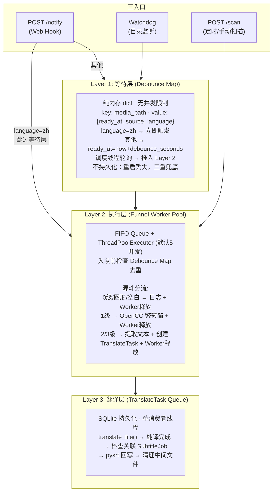
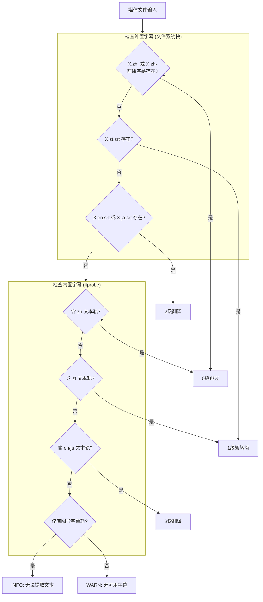
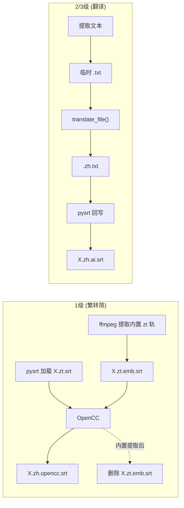
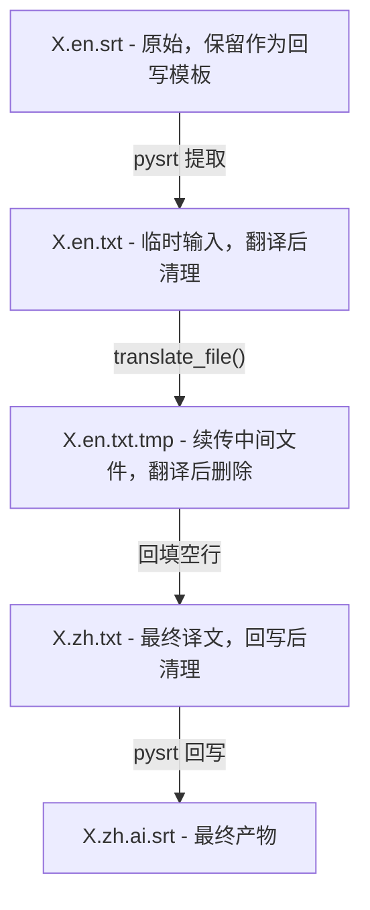
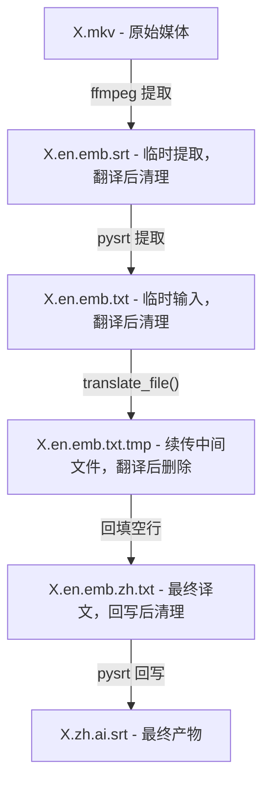
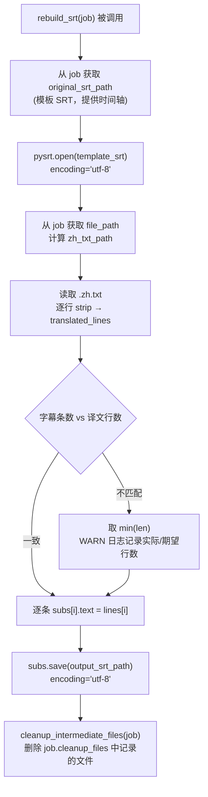
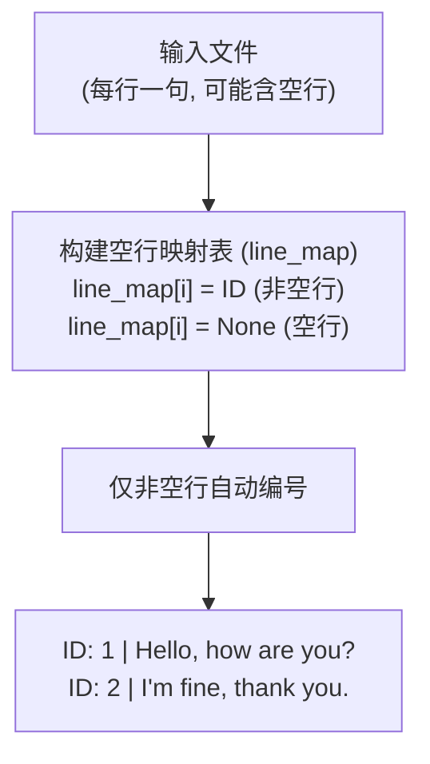
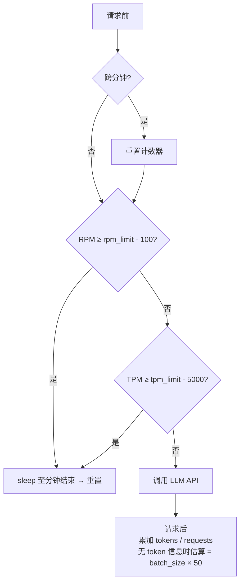
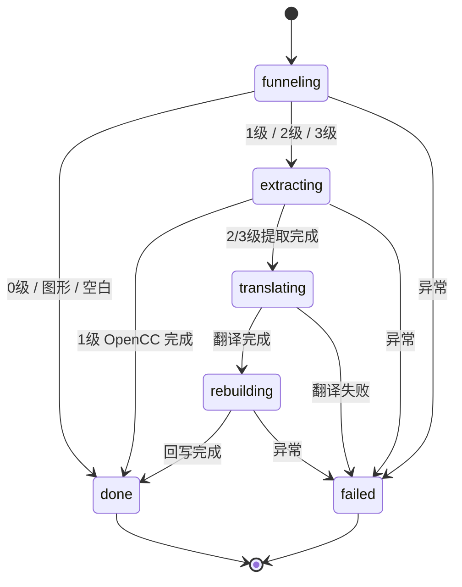
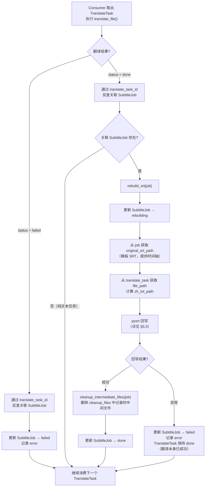

# SubtitleTranslator — 产品需求文档 (PRD)

> 版本: 1.0
> 日期: 2026-05-09
> 状态: 已确认

---

## 一、产品定位

### 1.1 产品定义

SubtitleTranslator 是一个字幕感知翻译微服务，以 Docker Compose 常驻容器运行。系统自动判断媒体文件的字幕状态，按优先级漏斗选择最优路径，最终产出简中 SRT 字幕文件。

### 1.2 核心能力

- **字幕感知**：自动检测媒体文件的内置/外置字幕状态，选择最优处理路径
- **智能翻译**：通过 LLM API 批量翻译字幕文本，支持 Chat/MT 两种模型策略
- **繁简转换**：OpenCC 繁体转简体，无需翻译
- **三入口驱动**：Web Hook + 目录监听 + 定时/手动扫描
- **专属命名**：`zh.ai` / `zh.opencc` 标识符，与第三方工具产出 100% 隔离

---

## 二、功能需求

| # | 需求 | 说明 |
|---|------|------|
| F1 | 常驻微服务容器 | Docker Compose 部署，常驻运行，端口可配置 |
| F2 | 三入口事件驱动 | POST /notify (Web Hook) + Watchdog (目录监听) + POST /scan (定时/手动全盘扫描) |
| F3 | 三层管道 | 等待层(Debounce) → 执行层(Worker Pool) → 翻译层(Consumer)，逐层收窄并发 |
| F4 | 判断漏斗 | 0级跳过 / 1级繁转简 / 2级外置翻译 / 3级内置翻译 / 图形字幕跳过 / 无字幕跳过 |
| F5 | 专属字幕命名 | 1级输出 `.zh.opencc.srt`，2/3级输出 `.zh.ai.srt`，防第三方冲突 |
| F6 | 分批翻译 | 每批 N 句（可配置，默认 20），前文上下文窗口（默认 5 句） |
| F7 | 模型类型分流 | Chat 模型：注入术语表 + 语义指令；MT 模型：纯文本平铺 + 裁剪上下文翻译 |
| F8 | API 限速 | RPM/TPM 双限，内部自动留余量，绝对不抛 429 |
| F9 | 断点续传 | 每批原子写入 .tmp，重启后自动恢复 |
| F10 | Prompt 热更新 | system_prompt.txt + glossary.json 每次翻译从磁盘读取，修改即生效 |
| F11 | 配置管理 | config.json + 环境变量覆盖，启动时自动生成默认配置 |
| F12 | 双模型数据架构 | SubtitleJob（字幕作业）+ TranslateTask（翻译任务），关注点分离 |
| F13 | 启动恢复 | 自动恢复中断任务、清理残留文件、触发全盘扫描 |
| F14 | 日志系统 | RotatingFileHandler，10MB/文件，5 备份 |

---

## 三、系统架构

### 3.1 三层管道



### 3.2 入口路由规则

| 入口 | 条件 | 路由目标 |
|------|------|----------|
| POST /notify | language=zh | 跳过等待层，直接入执行层 FIFO Queue |
| POST /notify | 其他/无 language | 进入等待层 Debounce Map |
| Watchdog | 新媒体文件 | 进入等待层 Debounce Map |
| POST /scan | 批量媒体文件 | 跳过等待层，直接入执行层 FIFO Queue |

---

## 四、判断漏斗

### 4.1 优先级表

| 级别 | 命中条件 | 动作 | 产物 | 耗时 |
|:---:|---|---|---|:---:|
| 0级 | 外置 `X.zh.` 或 `X.zh-` 前缀字幕存在，或内置含 `zh` 轨 | 跳过 | — | 0s |
| 1级 | 外置 `X.zt.srt` 存在，或内置含 `zt` 轨 | OpenCC 繁转简 | `X.zh.opencc.srt` | <1s |
| 2级 | 外置 `X.en.srt` 或 `X.ja.srt` 存在 | pysrt 提取 → 翻译 | `X.zh.ai.srt` | — |
| 3级 | 内置含 en/ja 轨 | ffmpeg 提取 → pysrt → 翻译 | `X.zh.ai.srt` | — |
| — | 内置仅含图形字幕轨 (vobsub/PGS) | INFO 日志 · 跳过 | — | 0s |
| — | 以上都不满足 | WARN 日志 · 跳过 | — | 0s |

### 4.2 执行流程



### 4.3 外置字幕搜索与匹配

- **搜索范围**：媒体文件所在目录 + 其下的 `Subs/` 子目录
- **zh 匹配**：`X.zh.` 前缀或 `X.zh-` 前缀 + `.srt` 结尾
  - 覆盖场景：`X.zh.srt`、`X.zh.ai.srt`、`X.zh.opencc.srt`、`X.zh-CN.srt`、`X.zh-Hans.srt` 等所有 `zh` 变体
  - 命中后直接归类为 `zh`，不再解析语言后缀
- **其他语言匹配**：`rsplit(".", 2)` 分解为 `stem.lang_suffix.srt`，basename 精确匹配后 `normalize_language()` 映射
  - 例如 `X.en.srt` → rsplit → `["X", "en", "srt"]` → normalize → `en`
- **basename 前缀校验**：在进行 rsplit 分解前，先检查文件名是否以 `{media_stem}.` 开头，不匹配则直接跳过，避免 rsplit 处理不相关文件

### 4.4 多字幕轨优先级

zh > zt > en > ja。同时有 zt 和 en → 选 zt。多条同语言轨 → 取第一条。

### 4.5 语言标签映射

```python
LANG_MAP = {
    "zh": "zh", "zho": "zh", "chi": "zh", "chinese": "zh", "zh-cn": "zh", "zh-hans": "zh",
    "zt": "zt", "zht": "zt", "zh-tw": "zt", "zh-hant": "zt",
    "en": "en", "eng": "en", "english": "en",
    "ja": "ja", "jpn": "ja", "japanese": "ja",
}
```

- `normalize_language()` 剥离 `:hi`/`:forced` 后缀后查表
- `LANG_MAP_OVERRIDE` (JSON 格式) 可追加映射

---

## 五、SRT 翻译管道

### 5.1 数据流总览



### 5.2 2级（外置字幕翻译）



### 5.3 3级（内置字幕翻译）



### 5.4 SRT 文本提取

从 SRT 提取纯文本时：
1. **过滤 HTML/ASS 标签**：正则移除 `<i>`, `<b>`, `<font>`, `{\an8}` 等样式标签
2. **多行合并**：将换行替换为空格，每条字幕输出为单行
3. **pysrt 编码**：显式传入 `encoding="utf-8"`

### 5.5 SRT 回写



**回写规则**：

| 要素 | 说明 |
|------|------|
| 模板 SRT | 2 级使用原始外置 SRT（如 `X.en.srt`），3 级使用 ffmpeg 提取的 `X.en.emb.srt`；模板仅提供时间轴和序号，文本内容被替换 |
| 译文输入 | 读取 `.zh.txt`（纯译文，每行一句，空行已按 line_map 回填），过滤空行后得到 translated_lines |
| 对位替换 | `subs[i].text = translated_lines[i]`，逐条按序替换，多行字幕合并为单行后翻译，回写保持单行 |
| 行数不匹配 | 取 `min(len(subs), len(translated_lines))`，WARN 日志记录实际/期望行数，不中断流程 |
| pysrt 编码 | 加载和保存均显式传入 `encoding="utf-8"` |

**中间文件清理**：

翻译完成并回写 SRT 后，删除 `job.cleanup_files` 中记录的中间文件：

| 级别 | 清理文件 |
|------|----------|
| 1 级内置 | `X.zt.emb.srt`（ffmpeg 提取，OpenCC 转换后立即删除） |
| 2 级 | `X.en.txt`（提取输入）、`X.zh.txt`（翻译译文） |
| 3 级 | `X.en.emb.srt`（提取 SRT）、`X.en.emb.txt`（提取输入）、`X.en.emb.zh.txt`（翻译译文） |

> `.tmp` 续传文件不在 cleanup_files 中——它在 `translate_file()` 内部翻译完成后即被删除，无需后续清理。

---

## 六、翻译批处理

### 6.1 文本预处理



### 6.2 分批 + 上下文窗口

**Chat 模型** (默认)：

```
User Prompt:
  术语表：{...}

  前文上下文（仅供参考，不要翻译）：
  ID: 16 | ...
  ...
  ID: 20 | ...

  需要翻译的内容：
  ID: 21 | ...
  ...
  ID: 40 | ...
```

**MT 模型**：

```
User Prompt (纯文本平铺，无指令词):
  ID: 16 | ...                ← 前上下文 (5句)
  ...
  ID: 20 | ...
  ID: 21 | ...                ← 正式翻译内容 (20句)
  ...
  ID: 40 | ...
→ 裁剪：仅保留 ID 21~40
```

### 6.3 LLM 请求参数

| 参数 | 值 | 说明 |
|------|----|------|
| model | config `llm.model` | — |
| temperature | config `llm.temperature` (默认 0.3) | 可配置 |
| timeout | config `llm.timeout` (默认 120s) | — |

### 6.4 输出解析与校验

1. 宽容忍正则: `^ID:\s*(\d+)\s*\|\s*(.+)$`
2. ID 范围过滤：仅保留 expected_ids
3. 行数校验：发送 N 句 → 期望返回 N 行；不足则重试
4. ID 连续性校验：不连续则重试

### 6.5 断点续传

- 每批翻译完成后原子化写入 .tmp（格式 `ID: n | translated_text`）
- 同时更新 SQLite 进度
- 翻译全部完成后按 line_map 回填空行 → .zh.txt → 删除 .tmp
- 批次间应节流，具体时长留给实现

### 6.6 重试策略

- 最大重试次数: `llm.max_retries` (默认 3)
- 间隔: 5s → 10s → 20s (指数退避)
- 3 次仍失败 → 标记任务 failed，继续消费队列

### 6.7 输出路径规则

路径替换时需优先判断 `.en.txt` / `.ja.txt` 后缀，再兜底 `replace(".txt", ".zh.txt")`。若不做优先判断，`X.en.txt` 会被错误替换为 `X.en.zh.txt`（3 级路径），而非正确的 `X.zh.txt`（2 级路径）。

| 输入文件 | 优先判断 | 输出文件 | 级别 |
|----------|---------|----------|------|
| `X.en.txt` | `.endswith(".en.txt")` ✅ | `X.zh.txt` | 2 级 |
| `X.ja.txt` | `.endswith(".ja.txt")` ✅ | `X.zh.txt` | 2 级 |
| `X.en.emb.txt` | `.endswith(".en.txt")` ❌ → 兜底 | `X.en.emb.zh.txt` | 3 级 |
| `X.ja.emb.txt` | `.endswith(".ja.txt")` ❌ → 兜底 | `X.ja.emb.zh.txt` | 3 级 |
| 其他 `X.txt` | 兜底 `replace(".txt", ".zh.txt")` | `X.zh.txt` | — |

---

## 七、限速拦截器



**目标**：绝对不抛出 HTTP 429

---

## 八、配置方案

### 8.1 设计原则

- **config.json** 承载所有配置项，提供默认值
- **环境变量** 优先级高于 config.json
- **必填项**: `llm.api_url` 和 `llm.api_key`，缺失时程序应退出
- 默认值只定义一份

**优先级**：环境变量 > config.json > 默认值

### 8.2 启动加载流程

1. config.json 不存在 → 用默认值生成
2. 存在 → 读取并合并默认值（补全新增字段）
3. 遍历环境变量覆盖映射，有设置则覆盖
4. 仅在首次生成或环境变量覆盖时写回 config.json
5. 校验必填项
6. 检测 prompts 目录，若 `system_prompt.txt` 或 `glossary.json` 不存在则用内置默认值生成（不区分 `model_type`，两个文件均为必要文件；MT 模型下 `glossary.json` 存在但不注入，用户切换为 Chat 模型后可立即生效）
7. 缓存配置对象（进程生命周期内不重新加载）

### 8.3 config.json 结构

```jsonc
{
  "app_port": 9800,
  "llm": {
    "api_url": "",                  // [必填]
    "api_key": "",                  // [必填]
    "model": "",
    "model_type": "chat",           // chat / mt
    "timeout": 120,
    "temperature": 0.3,
    "batch_size": 20,
    "context_size": 5,
    "rpm_limit": 1000,
    "tpm_limit": 50000,
    "max_retries": 3
  },
  "pipeline": {
    "debounce_seconds": 60,
    "debounce_poll_interval": 10,
    "funnel_workers": 5,
    "scan_interval": 0,
    "scan_dir": "/media"
  },
  "media": {
    "extensions": [".mkv", ".mp4", ".avi", ".wmv", ".flv", ".ts", ".m2ts"],
    "lang_map_override": {}
  },
  "watchdog": {
    "enabled": true,
    "path": "/media"
  }
}
```

### 8.4 环境变量覆盖映射

| 环境变量 | 覆盖路径 | 类型转换 |
|----------|----------|----------|
| `LLM_API_URL` | `llm.api_url` | str |
| `LLM_API_KEY` | `llm.api_key` | str |
| `APP_PORT` | `app_port` | int |
| `LLM_MODEL` | `llm.model` | str |
| `LLM_MODEL_TYPE` | `llm.model_type` | str |
| `LLM_TIMEOUT` | `llm.timeout` | int |
| `LLM_TEMPERATURE` | `llm.temperature` | float |
| `BATCH_SIZE` | `llm.batch_size` | int |
| `CONTEXT_SIZE` | `llm.context_size` | int |
| `RPM_LIMIT` | `llm.rpm_limit` | int |
| `TPM_LIMIT` | `llm.tpm_limit` | int |
| `MAX_RETRIES` | `llm.max_retries` | int |
| `DEBOUNCE_SECONDS` | `pipeline.debounce_seconds` | int |
| `DEBOUNCE_POLL_INTERVAL` | `pipeline.debounce_poll_interval` | int |
| `FUNNEL_WORKERS` | `pipeline.funnel_workers` | int |
| `SCAN_INTERVAL` | `pipeline.scan_interval` | int |
| `SCAN_DIR` | `pipeline.scan_dir` | str |
| `MEDIA_EXTENSIONS` | `media.extensions` | 逗号分隔→list |
| `LANG_MAP_OVERRIDE` | `media.lang_map_override` | JSON→dict |
| `WATCHDOG_ENABLED` | `watchdog.enabled` | "true"/"false"→bool |
| `WATCHDOG_PATH` | `watchdog.path` | str |

---

## 九、数据模型

### 9.1 TranslateTask

```sql
CREATE TABLE translate_task (
    id TEXT PRIMARY KEY,
    file_path TEXT NOT NULL,
    status TEXT NOT NULL,           -- queued / processing / done / failed
    progress TEXT,
    current_batch INTEGER DEFAULT 0,
    total_batches INTEGER DEFAULT 0,
    created_at TEXT NOT NULL,
    updated_at TEXT NOT NULL,
    error TEXT
);
```

### 9.2 SubtitleJob

```sql
CREATE TABLE subtitle_job (
    id TEXT PRIMARY KEY,
    media_path TEXT NOT NULL,
    status TEXT NOT NULL,           -- funneling / extracting / translating / rebuilding / done / failed
    funnel_level INTEGER,           -- 0 / 1 / 2 / 3 / null
    original_srt_path TEXT,
    output_srt_path TEXT,
    cleanup_files TEXT,             -- JSON 数组
    translate_task_id TEXT,
    created_at TEXT NOT NULL,
    updated_at TEXT NOT NULL,
    error TEXT
);
```

### 9.3 SubtitleJob 状态机

等待层（DebounceMap）为纯内存结构，不向 `subtitle_job` 表写入状态记录。文件在等待层到期后、进入执行层时才创建 SubtitleJob 记录，初始状态为 `funneling`。容器重启后等待层数据丢失，由三重兜底机制（全盘扫描 + Watchdog 重检测 + Web Hook 重触发）重新覆盖。



### 9.4 Consumer 回写触发流程

Consumer 线程翻译完成后，主动检查关联的 SubtitleJob 并触发 SRT 回写。这是 `translating → rebuilding → done` 状态转换的实际驱动逻辑。



**关键设计**：

| 要点 | 说明 |
|------|------|
| 推动者 | Consumer 线程在 `translate_file()` 返回后主动检查关联 SubtitleJob，无需外部调度 |
| 反查方式 | 通过 `translate_task_id` 在 `subtitle_job` 表中反查关联 job |
| 回写失败隔离 | 回写失败仅标记 SubtitleJob 为 `failed`，TranslateTask 保持 `done`（翻译本身已成功），避免重复翻译 |
| 清理时机 | 回写成功后才清理中间文件，回写失败时保留中间文件便于人工排查 |
| 纯文本任务 | 无关联 SubtitleJob 的 TranslateTask（如遗留的纯文本翻译），翻译完成后无需回写，直接跳过 |

### 9.5 分离原则

| | SubtitleJob | TranslateTask |
|---|---|---|
| 关注点 | "这个媒体文件需要什么处理？" | "把这个 .txt 翻译成 .zh.txt" |
| 知道 | 媒体文件、漏斗、SRT、清理 | 文件路径、进度、断点续传 |
| 不知道 | LLM、分批、翻译细节 | 媒体文件、字幕、漏斗 |

### 9.6 竞态与防重复

- 创建 TranslateTask + 关联 SubtitleJob 在同一 DB 事务中提交
- **三层防重复**：
  1. 漏斗幂等（0级跳过）
  2. SubtitleJob 去重（活跃 job 存在则跳过）
  3. TranslateTask 去重（活跃 task 存在则跳过）
- FIFO Queue 去重：入队前检查 Debounce Map

---

## 十、API 设计

### 10.1 POST /notify

外部服务（如 Bazarr）下载字幕后通过 Web Hook 触发。

**请求体**：

| 字段 | 必填 | 说明 |
|------|------|------|
| `media_path` | 是 | 视频文件路径（必须是文件，扩展名须在 `media.extensions` 白名单中） |
| `language` | 否 | 字幕语言码，可能含 `:hi`/`:forced` 后缀 |
| `subtitle_path` | 否 | 字幕文件路径，辅助信息 |

**错误码**：

| 条件 | HTTP | error | message |
|------|------|-------|---------|
| 管道未初始化 | 503 | `PIPELINE_NOT_READY` | `Pipeline not initialized` |
| media_path 为目录 | 400 | `INVALID_MEDIA_PATH` | `media_path must be a file, not a directory` |
| 扩展名不在白名单 | 400 | `UNSUPPORTED_EXTENSION` | `media_path extension '...' is not a supported media file` |

**校验顺序**：管道初始化 → 目录检查 → 扩展名白名单，按序短路返回。扩展名白名单来源为 `config["media"]["extensions"]`，通过 `os.path.splitext` 提取 `media_path` 的扩展名后与白名单比较（大小写不敏感）。

> **错误响应格式**：所有错误响应统一为 `{"detail": {"error": "CODE", "message": "描述"}}`。

**响应**：

```json
// language=zh
{"status": "accepted", "route": "immediate", "message": "简中字幕已到达，跳过等待层直接处理"}

// 其他
{"status": "accepted", "route": "debounce", "message": "已进入等待层，将在 60 秒后处理"}
```

### 10.2 POST /scan

**请求体**：

| 字段 | 必填 | 说明 |
|------|------|------|
| `dir_path` | 是 | 扫描根目录 |

**错误码**：

| 条件 | HTTP | error | message |
|------|------|-------|---------|
| 扫描进行中 | 409 | `SCAN_IN_PROGRESS` | `上次扫描尚未完成，请稍后重试` |
| 目录不存在 | 400 | `DIRECTORY_NOT_FOUND` | `Directory not found: ...` |
| 管道未初始化 | 503 | `PIPELINE_NOT_READY` | `Pipeline not initialized` |

> 错误响应格式同 10.1。

**响应**：

```json
{"count": 15, "message": "已扫描到 15 个待处理媒体文件，已加入执行层队列"}
```

`count` 为入队数（已在 Debounce Map 中的跳过，已有活跃 SubtitleJob 的在 Worker 执行时去重跳过）。

### 10.3 GET /health

```json
{"status": "ok"}
```

---

## 十一、Watchdog 目录监听

- **技术选型**: Python `watchdog` 库
- **监听目标**: `/media` (可配置) 下新增的媒体文件
- **事件过滤**: 仅响应 `FileCreatedEvent`
- **额外过滤**: 忽略隐藏文件、临时文件
- **处理**: 检测到新媒体文件 → 进入等待层 Debounce Map

---

## 十二、媒体文件扫描

### 12.1 全盘扫描

`scan_directory()` 递归遍历目录，三重过滤：

| 过滤 | 规则 |
|------|------|
| 扩展名 | 在 `media.extensions` 中 |
| 隐藏文件 | basename 不以 `.` 开头 |
| 存在性 | 同目录下不存在 `X.zh.` 或 `X.zh-` 前缀的字幕 |

纯函数，只负责扫描+过滤，入队逻辑在调用方。

### 12.2 定时扫描

APScheduler `BackgroundScheduler`，按 `pipeline.scan_interval` 间隔触发，0 = 禁用。

### 12.3 扫描节流

`threading.Lock` 互斥，扫描进行中返回 409 Conflict。

---

## 十三、启动恢复流程

1. **init_db()** — 创建/验证数据库表
2. **恢复 TranslateTask** — processing 重置为 queued（自动续传）
3. **清理残留 SubtitleJob** — funneling/extracting/rebuilding 标记 failed + 清理 cleanup_files；translating 保留
4. **清理残留中间文件** — 扫描 .emb.srt/.emb.txt/*.en.txt/*.ja.txt/*.zh.txt，排除 translating 状态关联的文件
5. **初始化三层管道** — DebounceMap + WorkerPool + Consumer + Watchdog + Scheduler
6. **全盘扫描** — 重新扫描，新文件入队

---

## 十四、日志设计

- **文件**: `/app/logs/subtitle_translator.log`
- **轮转**: RotatingFileHandler, maxBytes=10MB, backupCount=5
- **内容**: API 调用详情、限速事件、任务生命周期、异常事件

---

## 十五、Prompt 热更新

```
/app/prompts/
├── system_prompt.txt      所有模型共用，每次翻译前从磁盘读取
└── glossary.json          仅 Chat 模型注入，格式 {"term": "翻译", ...}
```

- 不做内存缓存 → 修改即生效
- Chat 模型注入格式: `"术语表：{json}\n\n{user_prompt}"`
- MT 模型不注入术语表

**首次生成策略**：启动时若文件不存在，用内置默认值生成（`system_prompt.txt` 使用硬编码默认提示词，`glossary.json` 生成空字典 `{}`）。不区分 `model_type`——两个文件均为必要文件，`glossary.json` 在 MT 模型下存在但不注入，用户后续切换为 Chat 模型后可立即生效，无需重启。已有文件永不覆盖。

---

## 十六、专属字幕命名规范

| 场景 | 后缀格式 | 示例 | 状态 |
|---|---|---|---|
| 繁转简 | `X.zh.opencc.srt` | `MyVideo.zh.opencc.srt` | 当前漏斗触发 |
| AI 翻译 | `X.zh.ai.srt` | `MyVideo.zh.ai.srt` | 当前漏斗触发 |
| 混合 | `X.zh.ai.opencc.srt` | `MyVideo.zh.ai.opencc.srt` | 兼容项，当前漏斗不触发 |

**防冲突原理**: Bazarr 等第三方绝不会生成含 `zh.ai` 或 `zh.opencc` 的后缀。播放器识别 `.zh.` 为中文轨道，标识符安全忽略。

**扫描去重**: 媒体扫描和漏斗判断中，`X.zh.srt` 及所有 `X.zh.` 前缀 / `X.zh-` 前缀字幕均归类为 `zh`，检测到即跳过。

**混合命名说明**: 混合命名 `.zh.ai.opencc.srt` 为未来"翻译后转简"场景预留。当前漏斗中 `zt` 与 `en/ja` 为互斥分流（§4.4 优先级 zh > zt > en > ja），不存在同一任务既需 AI 翻译又需 OpenCC 繁转简的路径。

---

## 十七、目录结构

```
Compose/SubtitleTranslator/
├── app/
│   ├── main.py                     入口: FastAPI + 三层管道初始化
│   ├── api.py                      HTTP 路由: /notify, /scan, /health
│   ├── db.py                       数据库层: translate_task + subtitle_job
│   ├── config_loader.py            配置加载: config.json + 环境变量
│   ├── requirements.txt            依赖
│   │
│   ├── config/                     (volume 挂载，首次启动自动生成)
│   │   └── config.json
│   ├── prompts/                    (volume 挂载，首次启动自动生成)
│   │   ├── system_prompt.txt
│   │   └── glossary.json
│   │
│   ├── pipeline/                   三层管道核心
│   │   ├── debounce_queue.py       等待层 + 执行层
│   │   ├── funnel.py               判断漏斗
│   │   └── consumer.py             翻译层消费 + SRT 回写
│   │
│   ├── subtitle/                   字幕处理
│   │   ├── lang_utils.py           语言标签标准化
│   │   ├── srt_handler.py          SRT 解析/回写 (pysrt)
│   │   ├── opencc_handler.py       繁简转换 (OpenCC)
│   │   └── ffmpeg_handler.py       ffmpeg/ffprobe 封装
│   │
│   ├── scanner/                    输入源扫描
│   │   ├── media_scanner.py        媒体文件扫描
│   │   ├── watchdog_monitor.py     目录监听
│   │   └── scheduler.py            定时扫描 (APScheduler)
│   │
│   └── translate/                  翻译引擎
│       ├── translator.py           翻译主逻辑
│       ├── prompt_loader.py        Prompt 加载
│       ├── rate_limiter.py         限速
│       └── eta_tracker.py          ETA 追踪
│
├── Dockerfile
├── SubtitleTranslator.yml
├── SubtitleTranslator.env
├── config/ data/ logs/ prompts/    Volume 挂载源
└── media/                          媒体目录挂载
```

---

## 十八、依赖与部署

### 18.1 Python 依赖

```
fastapi==0.110.1
uvicorn==0.29.0
httpx==0.27.0
apscheduler==3.10.4
pydantic==2.6.4
pysrt==1.1.2
opencc-python-reimplemented==0.1.7
watchdog==4.0.0
```

### 18.2 系统依赖

Dockerfile 中安装 `ffmpeg`（字幕提取/探测）。

### 18.3 基础镜像

`python:3.12-slim`

---

## 十九、风险与缓解

| 风险 | 缓解措施 |
|------|----------|
| LLM API 不稳定/超时 | 超时重试 + 指数退避 + 任务状态标记 |
| 字幕-媒体文件名匹配失败 | basename 精确匹配 + 日志告警 |
| ffmpeg 提取失败 (vobsub/PGS) | 检测图形字幕 codec → INFO 日志 → 跳过 |
| Watchdog 事件风暴 | Debounce 去重 + 线程池限流 |
| 容器重启丢失等待层 | 启动全盘扫描 + Watchdog 重检测 + Web Hook 重触发 |
| 临时文件残留 | 翻译完成后清理；启动时扫描残留并清理 |
| 并发全盘扫描 | threading.Lock 互斥，409 Conflict |
| 命名冲突（第三方工具） | 专属标识符 zh.ai / zh.opencc |
| LLM 输出格式不严格 | 宽容忍正则 + 行数校验 + ID 连续性校验 + 重试 |
